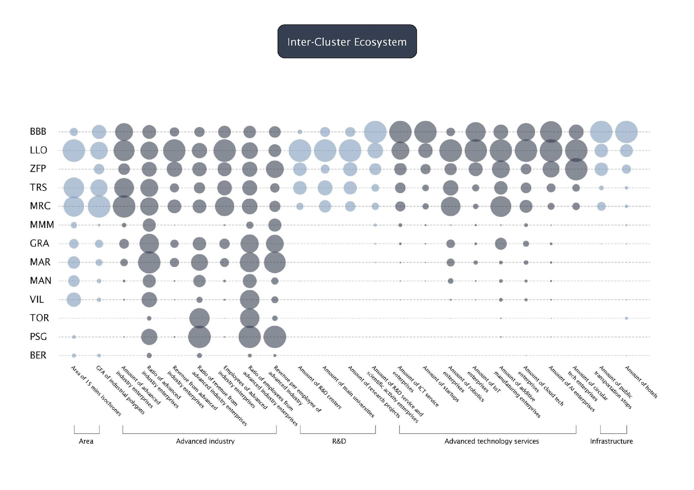

# Barcelona_Hightech_Clusters 
## Research. Clustering advanced industries to facilitate technology transfer in the Barcelona metropolitan region.  
team: [Ruobing Chen](https://github.com/RuobingC), Julia Thomas and Roman Pomazan 
[IAAC blog link](https://blog.iaac.net/the-perks-of-proximity-clustering-advanced-industries-to-facilitate-technology-transfer-in-the-barcelona-metropolitan-region/) 
tools: Grasshopper (Rhinoceros 3d 7), Hops, Decoding Spaces, Shrimp, Urbano, EarthEngine, QGIS, illustrator, Photoshop, Urbano, Python, Jupyter Notebook.

## Video presentation  

## Questions
- What role does proximity play in the development and growth of advanced technologies?
- How does technology transfer contribute to the creation of new businesses and convert knowledge into market value?
- What are advanced industries and how do they differ from advanced technologies?
- What are the KPIs of technology transfer in the World and Catalonia?
- What policies are in place to facilitate technology transfer in Spain and what could we add to them to stimulate the growth of advanced industries?

## What I learned: 
- Data mining with Python and OSMNX.
- Data preprocessing, cleaning, enriching, formatting with Python Pandas and Geopandas.
- Developing isochrones with Python, QGIS and Grasshopper + Earth Engine.
- Data vizualisation with Grasshopper, Urbano and Decoding Spaces.
- Overlapping maps and merging datasets to generate processed maps.
- Identify patterns and insights via map-based anaysis.

## Key takeaways
- Advanced industries exhibit varied hierarchies and codes for economic activities across the EU, the USA, China, and Japan, reflecting the diverse regulatory and market landscapes in these regions.
- Advanced technologies refer to advanced tools, processes and methodologies that promote innovation, while advanced industries are those that make extensive use of these technologies to produce high value-added products and services, although not always directly related companies with advanced industries, using advanced technologies.
- Proximity plays a crucial role in the common growth of startup ecosystems; however, as they mature, they begin to compete and tend to become more estranged.
- The primary contenders in the R&D market are the USA and China, which have invested billions of dollars in public R&D funds in recent years, showcasing their commitment to leading innovation and technological advancement.
- Approximately 95% of global R&D expenditure is concentrated within three regions: North America, with the USA playing a pivotal role; the European Economic Area (EEA), where Germany, the UK, France, Italy, and the Benelux countries are key contributors; and East Asia, encompassing China, Korea, Japan, Singapore, Taiwan, and Hong Kong, with China and Japan spearheading the development in the majority of advanced industries.
- In Spain, private investments in R&D account for 0.4% of the global total, while Catalonia alone contributes around 25% to the country's industrial-sourced GDP, highlighting its significant role in Spain's economic landscape and its potential as a hub for innovation and industrial development.
- Barcelona ranks between the 4th and 5th top startup hubs in Europe, increasingly aggregating startups that complement the advanced industries sector.
- The Government of Catalonia aims to reindustrialize the community by increasing the Gross Value Added (GVA) from 20% to 25% in 5 years, thanks to the stimulation of advanced industries.
- Several advanced industries, such as Pharmtech, Biotech, and Chemicaltech, lead the Catalan economy, while other globally demanded sectors like robotics, additive manufacturing, and electric vehicles are underrepresented in the Barcelona metropolitan region, and this policy-making rsearch is focused on stimulating these latter sectors.
- While traditional industries are typically located along main rail corridors, advanced industries can be dispersed throughout the entire metropolitan area.
- Policy-making effectively employs clustering as a tool for stimulating economic development, making geographically linked clusters the most potent instrument for the development of economic ecosystems.
- The real Barcelona agglomeration is woven from interconnected industrial and social clusters and is quite extensive compared to the limited metropolitan authorities.

## piece of code
1. overlapping data and merging maps with Grasshoper. [source>>](221104_AXO_CONNECTIVITY_LANDUSES_Roman ed02.gh)

## data visualization
### Technology transfer procedure.

### Global trends in R^D

### Data visualization of technology transfer in Spain.

### Data visualization of the correlation between the number and type of companies and their revenue.

### Scheme of an innovation ecosystem.

### Data visualization of relatedness to advanced industries.

### Methodology of identification of geographical clusters.

### Filtering clusters by specific features. Isochrones in QGIS

### Map of selected proto-clusters defined by 2 top quantiles of revenue and number of employees in hightech companies. QGIS isochrones

### Map of specified AdvInd clusters and their specialisation. Isochrones in Grasshopper + Earth Engine + Hops

### Dynamic map of Cluster analysis.

### Scheme of intercluster ecosystem.

### Map of categorization of hightech clusters in the Metropolitan Barcelona.

### Proposal for policy-making to stimulate the development of specific hightech clusters.

### Data analys of the metropolitam area of Barcelona in comparison with the existing Metropolitan Authorities Area by overlapping with hightech clusters (160 against 33 municipalities)

##  References
- European Industrial Strategy - [European Commission](https://ec.europa.eu/info/strategy/priorities-2019-2024/europe-fit-digital-age/european-industrial-strategy_en)
- Metropolitan Areas in the World: Delineation and Population Trends - Ana I. Moreno-Monroy, Marcello Schiavina, Paolo Veneri.
- Definition Matters: Metropolitan Areas and Agglomeration Economies in a Large Developing Country - Bosker, Maarten.
- The Pan-European Population Distribution Across Consistently Defined Functional Urban Areas - Schmidheiny, Kurt.
- Urban Growth and Transportation - Duranton, Gilles.
- Ley 14/2018, de 5 de junio, de gestión, modernización y promoción de las áreas industriales de la Comunitat Valenciana - [BOE-A-2018-8949](https://www.boe.es/buscar/doc.php?id=BOE-A-2018-8949)
- Recovery Plan Next Generation EU - [Next Generation EU](https://next-generation-eu.europa.eu/index_en)
- Recovery, Transformation and Resilience Plan of Spain - [Ministerio de Industria, Comercio y Turismo](https://www.mincotur.gob.es/en-us/recuperacion-transformacion-resiliencia/paginas/plan-recuperacion-transformacion-resiliencia.aspx)
- Startup Law Spain - Ley 28/2022, de 21 de diciembre, de fomento del ecosistema de las empresas emergentes - [BOE-A-2022-21739](https://www.boe.es/diario_boe/txt.php?id=BOE-A-2022-21739)
- Roadmap for the Circular Economy in Catalonia 2021-2027 - [Interreg Europe](https://projects2014-2020.interregeurope.eu/fileadmin/user_upload/tx_tevprojects/library/file_1655473320.pdf)
- Listado Completo de Actividades de la CNAE 2009 - [CNAE](https://www.cnae.com.es/lista-actividades.php)
- Ley 15/2020, de 22 de diciembre, de las áreas de promoción económica urbana de la Comunidad Autónoma Cataluña - [BOE-A-2021-462](https://www.boe.es/buscar/pdf/2021/BOE-A-2021-462-consolidado.pdf)
- Catalonia 2020 Strategy - [Generalitat de Catalunya](http://catalunya2020.gencat.cat/web/.content/00_catalunya2020/Documents/angles/fitxers/ecat2020_en.pdf)
- The Strength of an Innovative and Outward-Looking Nation: Catalan Economy - Report by Generalitat Catalunya.
- The Artificial Intelligence in Catalonia: Technology Report by ACCIO - [ACCIO](https://accio.gencat.cat/en/index.html)
- Asia Strategy of Barcelona City Council - [Barcelona City Council](https://ajuntament.barcelona.cat/relacionsinternacionalsicooperacio/sites/default/files/estrategiaasia_en.pdf)
- Climate Plan 2018-2030 of Barcelona - [Barcelona City Council](https://www.barcelona.cat/climateemergency/en)
- NewSpace Strategy of Catalonia
- Atlas of Innovation Districts - Aretian. [Aretian](https://www.aretian.com/atlas)
- Metroverse: The Growth Lab’s Urban Economy Navigator - [Harvard CID](https://metroverse.cid.harvard.edu/)
- El Compromiso Metropolitano 2030 - [PEMB](https://pemb.cat/es/barcelona-dema/)
- Global Friction Surface 2019 - [Google Earth Engine](https://developers.google.com/earth-engine/datasets/catalog/Oxford_MAP_friction_surface_2019)
- Copernicus CORINE Land Cover CLC 2018 - [Google Earth Engine](https://developers.google.com/earth-engine/datasets/catalog/COPERNICUS_CORINE_V20_100m)
- GeoMining Technology - Iacopo Neri. [GitHub](https://github.com/neriiacopo/GeoMining-EE-Hops)
- A Methodology for Identifying the Drivers of Industrial Clusters: The Foundation of Regional Competitive Advantage - Edward W. Hill and John F. Brennan. Volume 14, Issue 1. [DOI](https://doi.org/10.1177/089124240001400109)
